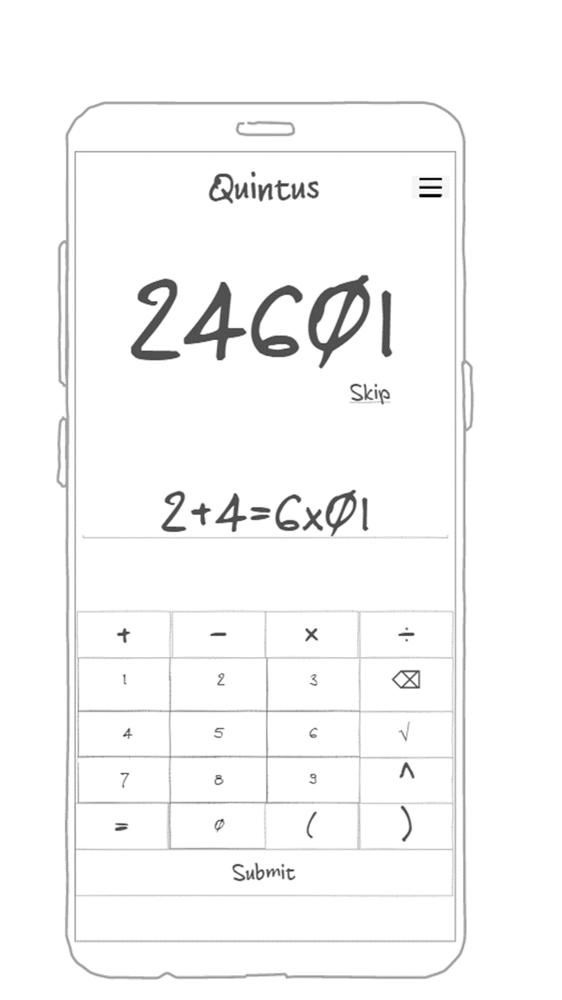

Quintus is a game that I came up with in high school and have been playing ever since.
The rules are simple: take any five digits and, while keeping them in their order,
try to turn it into a valid equation.
For instance, 84604 could have the solution 8-4+(6*0)=4. Seems simple, right?
Can you find a solution for 65535?
In making Quintus a self contained program, everything I was once using would all be in 
the same place, streamlined for crunching number after number.
Not only that, but having it online would open many more possibilites for social play,
progression tracking, and customization options.



Simon HTML notes:

A lot of the knowledge I've gained in other programming languages
transfers over to web development pretty nicely, like taking things
slowly, implementing features one at a time, and overall making things
simple and straightforward will always be the best course of action.

There are clearly a lot of things implemented into modern HTML that
make programming easier for those just learning to use it, not to
mention the many resources on the internet to help explain things.

When thinking about my final project for the class, I had some concerns
about things like having multiple pages or how images will display,
but after having done this assignment I can see that I was worried about
those things for nothing - little things like that are much simpler than
I previously thought.

Simon CSS notes:

I feel like CSS is kind of a nice mid-way point between html and Javascript
as far as difficulty goes - while not as simple as html, it nevertheless
is still pretty straightforward and, as far as I can tell so far,
doesn't require a lot of knowledge of crazy intricate programming stuff
like other languages do.

I'm somewhat intimidated by all the decisions that come with CSS - 
how do I want my site to look? What are all the different ways
people may be visiting my site, and how should I prepare for each of
those? What if something seems really simple in my mind, but is actually
really tricky to implement? For now, I think I'm just going to keep things
simple.

I'm still new to the world of computer programming, so I'm still
somewhat perplexed at how files of different language types interact
with each other. Thankfully, learning all of this interesting stuff
is one of the things I really enjoy about computer science.

Startup HTML and CSS notes:

Man, people weren't kidding when they said that alignment in CSS is a
patience tester. I was able to get things oriented in a way that looks
good to me now, but I spent a lot of time and I'm still not done. I
suppose it stems from there being so many options for alignment built
into CSS, which ultimately is a good thing, but compared to the relative
simplicity of other basic functions, it's definitely a hurdle.

One of the nice things about working on something that I'm interested in
and came up with on my own is that I can decide what features to roll
out and at what pace. It took a lot of work to get my page having the
basics, but I can now tinker with it to implement other pages and
elements without, hopefully, having to redo what I've already got solid.

Simon Javascript notes:

All programs are different, needing some kinds of code but not others.
There are many things I still really don't understand about Javascript.
Thankfully, I think my startup is relatively simple. Of course, I will
need to know a lot more than what my startup project needs if I am to
make more programs - I can't just cross my fingers and hope that nothing
I don't understand ever comes up. But I'm glad I can build my program
at my own pace, and that having it be personally picked gives me the
motivation to figure out all the different components.

Javascript is the most "code-y" of the three languages that we have
learned about thus far - it has a lot of different options for a lot
of powerful features.


Mid-term notes:

Learning philosophy:
1. Technology
2. Art
3. Social
4. Discovery

HTML = Hypertext Markup Language - invented by Tim Berners-Lee
HTTP = HyperText Transfer Protocol
URL = Uniform Resource Locator
CSS = Cascading Style Sheets

“Always bet on JS” — Brendan Eich


Console commands:

pwd: present working directory (shows the file path you're in)

curl: Command line client URL browser

grep - Regular expression search

find - Find files

cat - Output the contents of a file

ps - View the currently running processes

kill - Kill a currently running process

sudo - Execute a command as a super user (admin)

ssh - Create a secure shell on a remote computer

scp - Securely copy files to a remote computer

ping - Check if a website is up

tracert - Trace the connections to a website

dig - Show the DNS information for a domain

| - Take the output from the command on the left and pipe, or pass, it to the command on the right
'> - Redirect output to a file. Overwrites the file if it exists
'>> - Redirect output to a file. Appends if the file exist

git add .

git status

-m "comment"

git log

Every commit has a unique identifier that is generated by hashing the file along with the timestamp using the SHA hashing algorithm. You can always refer to a specific commit in your version history by using its SHA. For example, if we want to temporarily switch back to a previous version to see what it contains we can use the checkout command. You only need to provide the first few characters of the SHA.

To get back to the top of the version chain, use the checkout command and reference the branch name, which is by default master.

Most of the time you don't want to reverse back to an earlier commit. Instead you just want to compare the differences between commits. We can do that with the diff command.

use the git branch A command and start working on the A branch with the git checkout A command. checkout the master branch and execute git merge A.

### [TCP/IP](https://en.wikipedia.org/wiki/Internet_protocol_suite) layers

| Layer       | Example         | Purpose                               |
| ----------- | --------------- | ------------------------------------- |
| Application | HTTPS           | Functionality like web browsing       |
| Transport   | TCP             | Moving connection information packets |
| Internet    | IP              | Establishing connections              |
| Link        | Fiber, hardware | Physical connections                  |

| Service        | Purpose                              |
| -------------- | ------------------------------------ |
| EC2            | Server                               |
| EC2 Elastic IP | Keep your IP address between reboots |
| Route 53       | Domain name                          | 
| Route 53       | DNS records                          |         


The DNS database records that facilitate the mapping of domain names to IP addresses come in several flavors. The main ones we are concerned with are the address (A) and the canonical name (CNAME) records. An A record is a straight mapping from a domain name to IP address. A CNAME record maps one domain name to another domain name. This acts as a domain name alias. You would use a CNAME to do things like map byu.com to the same IP address as byu.edu so that either one could be used.

Caddy handles all of the creation and rotation of web certificates. This allows us to easily support HTTPS.
Caddy serves up all of your static HTML, CSS, and JavaScript files. All of your early application work will be hosted as static files.
Caddy acts as a gateway for subdomain requests to your Simon and start up application services. For example, when a request is made to simon.yourdomain Caddy will proxy the request to the Simon application running with node.js as an internal web service.

The secure version of HTTP is called Secure Hypertext Transport Protocol (HTTPS). This is basically HTTP with a negotiated secure connection that happens before any data is exchanged. Having a secure connection means that all the data is encrypted using the TLS protocol. TLS is sometimes referred to by a now unsecure predecessor protocol named SSL. TLS works by negotiating a shared secret that is then used to encrypt data. You can see the actual negotiation that happens by using the console browser based application curl, along with the -v parameter to see the verbose output of the HTTPS exchange. The > /dev/null redirection throws away the actual HTTP response, since we only care about the negotiation, by redirecting the output to the null device.

Every HTML element may have attributes. Attributes describe the specific details of the element. For example, the id attribute gives a unique ID to the element so that you can distinguish it from other elements. The class attribute is another common element attribute that designates the element as being classified into a named group of elements. Attributes are written inside the element tag with a name followed by an optional value. You can use either single quotes (') or double quotes (") to delimit attribute values.

A hyperlink in HTML is represented with an anchor (a) element that has an attribute containing the address of the hyperlink reference (href). A hyperlink to BYU's home page looks like this:

```html
<a href="https://byu.edu">Go to the Y</a>
```

| element   | meaning                                                                |
| --------- | ---------------------------------------------------------------------- |
| `html`    | The page container                                                     |
| `head`    | Header information                                                     |
| `title`   | Title of the page                                                      |
| `meta`    | Metadata for the page such as character set or viewport settings       |
| `script`  | JavaScript reference. Either a external reference, or inline           |
| `include` | External content reference                                             |
| `body`    | The entire content body of the page                                    |
| `header`  | Header of the main content                                             |
| `footer`  | Footer of the main content                                             |
| `nav`     | Navigational inputs                                                    |
| `main`    | Main content of the page                                               |
| `section` | A section of the main content                                          |
| `aside`   | Aside content from the main content                                    |
| `div`     | A block division of content                                            |
| `span`    | An inline span of content                                              |
| `h<1-9>`  | Text heading. From h1, the highest level, down to h9, the lowest level |
| `p`       | A paragraph of text                                                    |
| `b`       | Bring attention                                                        |
| `table`   | Table                                                                  |
| `tr`      | Table row                                                              |
| `th`      | Table header                                                           |
| `td`      | Table data                                                             |
| `ol,ul`   | Ordered or unordered list                                              |
| `li`      | List item                                                              |
| `a`       | Anchor the text to a hyperlink                                         |
| `img`     | Graphical image reference                                              |
| `dialog`  | Interactive component such as a confirmation                           |
| `form`    | A collection of user input                                             |
| `input`   | User input field                                                       |
| `audio`   | Audio content                                                          |
| `video`   | Video content                                                          |
| `svg`     | Scalable vector graphic content                                        |
| `iframe`  | Inline frame of another HTML page                                      |

```html
<!-- commented text -->
```

| Character | Entity      |
| --------- | ----------- |
| &amp;     | `&amp;`     |
| <         | `&lt;`      |
| >         | `&gt;`      |
| "         | `&quot;`    |
| '         | `&apos;`    |
| &#128512; | `&#128512;` |

| Element    | Meaning                          | Example                                        |
| ---------- | -------------------------------- | ---------------------------------------------- |
| `form`     | Input container and submission   | `<form action="form.html" method="post">`      |
| `fieldset` | Labeled input grouping           | `<fieldset> ... </fieldset>`                   |
| `input`    | Multiple types of user input     | `<input type="" />`                            |
| `select`   | Selection dropdown               | `<select><option>1</option></select>`          |
| `optgroup` | Grouped selection dropdown       | `<optgroup><option>1</option></optgroup>`      |
| `option`   | Selection option                 | `<option selected>option2</option>`            |
| `textarea` | Multiline text input             | `<textarea></textarea>`                        |
| `label`    | Individual input label           | `<label for="range">Range: </label>`           |
| `output`   | Output of input                  | `<output for="range">0</output>`               |
| `meter`    | Display value with a known range | `<meter min="0" max="100" value="50"></meter>` |

| Type           | Meaning                           |
| -------------- | --------------------------------- |
| text           | Single line textual value         |
| password       | Obscured password                 |
| email          | Email address                     |
| tel            | Telephone number                  |
| url            | URL address                       |
| number         | Numerical value                   |
| checkbox       | Inclusive selection               |
| radio          | Exclusive selection               |
| range          | Range limited number              |
| date           | Year, month, day                  |
| datetime-local | Date and time                     |
| month          | Year, month                       |
| week           | Week of year                      |
| color          | Color                             |
| file           | Local file                        |
| submit         | button to trigger form submission |

| Attribute | Meaning                                                                             |
| --------- | ----------------------------------------------------------------------------------- |
| name      | The name of the input. This is submitted as the name of the input if used in a form |
| disabled  | Disables the ability for the user to interact with the input                        |
| value     | The initial value of the input                                                      |
| required  | Signifies that a value is required in order to be valid                             |

```html

```

```html
<audio controls src="testAudio.mp3"></audio>
```

```html
<video controls width="300" crossorigin="anonymous">
  <source
    src="https://commondatastorage.googleapis.com/gtv-videos-bucket/sample/BigBuckBunny.mp4"
  />
</video>
```

```html
<svg
  viewBox="0 0 300 200"
  xmlns="http://www.w3.org/2000/svg"
  stroke="red"
  fill="red"
  style="border: 1px solid #000000"
>
  <circle cx="150" cy="100" r="50" />
</svg>
```

```html
<canvas
  id="canvasDemo"
  width="300"
  height="200"
  style="border: 1px solid #000000"
></canvas>
<script>
  const ctx = document.getElementById('canvasDemo').getContext('2d');
  ctx.beginPath();
  ctx.arc(150, 100, 50, 0, 2 * Math.PI);
  ctx.fillStyle = 'red';
  ctx.strokeStyle = 'red';
  ctx.fill();
  ctx.stroke();
</script>
```


```css
p {
  font-family: sans-serif;
  font-size: 2em;
  color: navy;
  text-shadow: 3px 3px 1px #cccccc;
}
```

The selector `p` selects all paragraph elements in the HTML document. The four specified declarations then: 1) change the font to use a san-serif font, 2) increase the font size to be twice as big as the default font, 3) change the text color to be navy, and 4) create a gray shadow for the text.

```html
<link rel="stylesheet" href="styles.css" />
```


| Combinator       | Meaning                    | Example        | Description                                |
| ---------------- | -------------------------- | -------------- | ------------------------------------------ |
| Descendant       | A list of descendants      | `body section` | Any section that is a descendant of a body |
| Child            | A list of direct children  | `section > p`  | Any p that is a direct child of a section  |
| General sibling  | A list of siblings         | `p ~ div`      | Any p that has a div sibling               |
| Adjacent sibling | A list of adjacent sibling | `p + div`      | Any p that has an adjacent div sibling     |

| Property           | Value                              | Example             | Discussion                                                                     |
| ------------------ | ---------------------------------- | ------------------- | ------------------------------------------------------------------------------ |
| background-color   | color                              | `red`               | Fill the background color                                                      |
| border             | color width style                  | `#fad solid medium` | Sets the border using shorthand where any or all of the values may be provided |
| border-radius      | unit                               | `50%`               | The size of the border radius                                                  |
| box-shadow         | x-offset y-offset blu-radius color | `2px 2px 2px gray`  | Creates a shadow                                                               |
| columns            | number                             | `3`                 | Number of textual columns                                                      |
| column-rule        | color width style                  | `solid thin black`  | Sets the border used between columns using border shorthand                    |
| color              | color                              | `rgb(128, 0, 0)`    | Sets the text color                                                            |
| cursor             | type                               | `grab`              | Sets the cursor to display when hovering over the element                      |
| display            | type                               | `none`              | Defines how to display the element and its children                            |
| filter             | filter-function                    | `grayscale(30%)`    | Applies a visual filter                                                        |
| float              | direction                          | `right`             | Places the element to the left or right in the flow                            |
| flex               |                                    |                     | Flex layout. Used for responsive design                                        |
| font               | family size style                  | `Arial 1.2em bold`  | Defines the text font using shorthand                                          |
| grid               |                                    |                     | Grid layout. Used for responsive design                                        |
| height             | unit                               | `.25em`             | Sets the height of the box                                                     |
| margin             | unit                               | `5px 5px 0 0`       | Sets the margin spacing                                                        |
| max-[width/height] | unit                               | `20%`               | Restricts the width or height to no more than the unit                         |
| min-[width/height] | unit                               | `10vh`              | Restricts the width or height to no less than the unit                         |
| opacity            | number                             | `.9`                | Sets how opaque the element is                                                 |
| overflow           | [visible/hidden/scroll/auto]       | `scroll`            | Defines what happens when the content does not fix in its box                  |
| position           | [static/relative/absolute/sticky]  | `absolute`          | Defines how the element is positioned in the document                          |
| padding            | unit                               | `1em 2em`           | Sets the padding spacing                                                       |
| left               | unit                               | `10rem`             | The horizontal value of a positioned element                                   |
| text-align         | [start/end/center/justify]         | `end`               | Defines how the text is aligned in the element                                 |
| top                | unit                               | `50px`              | The vertical value of a positioned element                                     |
| transform          | transform-function                 | `rotate(0.5turn)`   | Applies a transformation to the element                                        |
| width              | unit                               | `25vmin`            | Sets the width of the box                                                      |
| z-index            | number                             | `100`               | Controls the positioning of the element on the z axis                          |

| Unit | Description                                                      |
| ---- | ---------------------------------------------------------------- |
| px   | The number of pixels                                             |
| pt   | The number of points (1/72 of an inch)                           |
| in   | The number of inches                                             |
| cm   | The number of centimeters                                        |
| %    | A percentage of the parent element                               |
| em   | A multiplier of the width of the letter `m` in the parent's font |
| rem  | A multiplier of the width of the letter `m` in the root's font   |
| ex   | A multiplier of the height of the element's font                 |
| vw   | A percentage of the viewport's width                             |
| vh   | A percentage of the viewport's height                            |
| vmin | A percentage of the viewport's smaller dimension                 |
| vmax | A percentage of the viewport's larger dimension                  |

```css
@font-face {
  font-family: 'Quicksand';
  src: url('https://cs260.click/fonts/quicksand.woff2');
}

p {
  font-family: Quicksand;
}
```

```css
@import url('https://fonts.googleapis.com/css2?family=Rubik Microbe&display=swap');

p {
  font-family: 'Rubik Microbe';
}
```

```css
p {
  text-align: center;
  font-size: 20vh;

  animation-name: demo;
  animation-duration: 3s;
}
```

```css
@keyframes demo {
  from {
    font-size: 0vh;
  }

  to {
    font-size: 20vh;
  }
}
```

```css
.none {
  display: none;
}

.block {
  display: block;
}

.inline {
  display: inline;
}

.flex {
  display: flex;
  flex-direction: row;
}

.grid {
  display: grid;
  grid-template-columns: 1fr 1fr;
}
```


**index.js**

```js
function sayHello() {
  console.log('hello');
}
```

**index.html**

```html
<head>
  <script src="javascript.js"></script>
</head>
<body>
  <button onclick="sayHello()">Say Hello</button>
  <button onclick="sayGoodbye()">Say Goodbye</button>
  <script>
    function sayGoodbye() {
      alert('Goodbye');
    }
  </script>
</body>
```

Variables are declared using either the let or const keyword. let allows you to change the value of the variable while const will cause an error if you attempt to change it.

| Type        | Meaning                                                    |
| ----------- | ---------------------------------------------------------- |
| `Null`      | The type of a variable that has not been assigned a value. |
| `Undefined` | The type of a variable that has not been defined.          |
| `Boolean`   | true or false.                                             |
| `Number`    | A 64 bit signed number.                                    |
| `BigInt`    | A number of arbitrary magnitude.                           |
| `String`    | A textual sequence of characters.                          |
| `Symbol`    | A unique value.                                            |

| Type       | Use                                                                                    | Example                  |
| ---------- | -------------------------------------------------------------------------------------- | ------------------------ |
| `Object`   | A collection of properties represented by name value pairs. Values can be of any type. | `{a:3, b:'fish'}`        |
| `Function` | An object that has the ability to be called.                                           | `function a() {}`        |
| `Date`     | Calendar dates and times.                                                              | `new Date('1995-12-17')` |
| `Array`    | An ordered sequence of any type.                                                       | `[3, 'fish']`            |
| `Map`      | A collection of key value pairs that support efficient lookups.                        | `new Map()`              |
| `JSON`     | A lightweight data-interchange format used to share information across programs.       | `{"a":3, "b":"fish"}`    |

You can also use the ternary operator. This provides a compact `if else` representation.

```js
a === 1 ? console.log(1) : console.log('not 1');
```

Here is an example of a JSON document.

```json
{
  "class": {
    "title": "web programming",
    "description": "Amazing"
  },
  "enrollment": ["Marco", "Jana", "فَاطِمَة"],
  "start": "2025-02-01",
  "end": null
}
```

You can convert JSON to, and from, JavaScript using the `JSON.parse` and `JSON.stringify` functions.

```js
const obj = { a: 2, b: 'crockford', c: undefined };
const json = JSON.stringify(obj);
const objFromJson = JSON.parse(json);

console.log(obj, json, objFromJson);

// OUTPUT:
// {a: 2, b: 'crockford', c: undefined}
// {"a":2, "b":"crockford"}
// {a: 2, b: 'crockford'}
```

The `string` class has several functions that accept regular expressions. This includes `match`, `replace`, `search`, and `split`.

JavaScript provides the `rest` syntax to make this easier. Think of it as a parameter that contains the `rest` of the parameters. To turn the last parameter of any function into a `rest` parameter you prefix it with three periods. You can then you can call it with any number of parameters and they are all automatically combined into an array.

```js
function hasNumber(test, ...numbers) {
  return numbers.some((i) => i === test);
}

hasNumber(2, 1, 2, 3);
// RETURNS: true
```

An example of destructuring arrays looks like the following.

```js
const a = [1, 2, 4, 5];

// destructure the first two items from a, into the new variables b and c
const [b, c] = a;

console.log(b, c);
// OUTPUT: 1, 2
```

```js
try {
  // normal execution code
} catch (err) {
  // exception handling code
} finally {
  // always called code
}
```

## This

The keyword `this` represents a variable that points to an object that contains the context within the scope of the currently executing line of code. The `this` variable is automatically declared and you can reference `this` anywhere in a JavaScript program. Because the value of `this` depends upon the context in which it is referenced, there are three different context that this can refer to:

1. **Global** - When `this` is referenced outside a function or object it refers to the `globalThis` object. The globalThis object represents the context for runtime environment. For example, when running in a browser, globalThis refers to the browser's window object.
1. **Function** - When `this` is referenced in a function it refers to the object that owns the function. That is either an object you defined or globalThis if the function is defined outside of an object. Note that when running is JavaScript strict mode, a global function's this variable is undefined instead of globalThis.
1. **Object** - When `this` is referenced in a object it refers to the object.

```js
function displayElement(el) {
  console.log(el.tagName);
  for (const child of el.children) {
    displayElement(child);
  }
}

displayElement(document);
```

| Event Category | Description           |
| -------------- | --------------------- |
| Clipboard      | Cut, copied, pasted   |
| Focus          | An element gets focus |
| Keyboard       | Keys are pressed      |
| Mouse          | Click events          |
| Text selection | When text is selected |

You create a promise by calling the Promise object constructor and passing it an executor function that runs the asynchronous operation. Executing asynchronously means that promise constructor may return before the promise executor function runs.

We can demonstrate asynchronous execution by using the standard JavaScript `setTimeout` function to create a delay in the execution of the code. The setTimeout function takes the number of milliseconds to wait and a function to call after that amount of time has expired. We call the delay function in a for loop in the promise executor and also a for loop outside the promise so that both code blocks are running in parallel.

Now that we know how to use a promise to execute asynchronously, we need to be able to set the state to `fulfilled` when things complete correctly, or to `rejected` when an error happens. The promise executor function takes two functions as parameters, `resolve` and `reject`. Calling `resolve` sets the promise to the `fulfilled` state, and calling `reject` sets the promise to the `rejected` state.

Consider the following "coin toss" promise that waits ten seconds and then has a fifty percent chance of resolving or rejecting.

```js
const coinToss = new Promise((resolve, reject) => {
  setTimeout(() => {
    if (Math.random() > 0.5) {
      resolve('success');
    } else {
      reject('error');
    }
  }, 10000);
});
```

With the ability to asynchronously execute and set the resulting state, we now need a way to generically do something with the result of a promise after it resolves. This is done with functionality similar to exception handling. The promise object has three functions: `then`, `catch`, and `finally`. The `then` function is called if the promise is fulfilled, `catch` is called if the promise is `rejected`, and `finally` is always called after all the processing is completed.

JavaScript Promise objects are great for asynchronous execution, but as developers began build large systems with promises they started wanting a more concise representation. This was provided with the introduction of the `async/await` syntax. The `await` keyword wraps the execution of a promise and removed the need to chain functions. The `await` expression will block until the promise state moves to `fulfilled`, or throws an exception if the state moves to `rejected`.

The `async` keyword declares that a function returns a promise. The `await` keyword wraps a call to the `async` function, blocks execution until the promise has resolved, and then returns the result of the promise.

